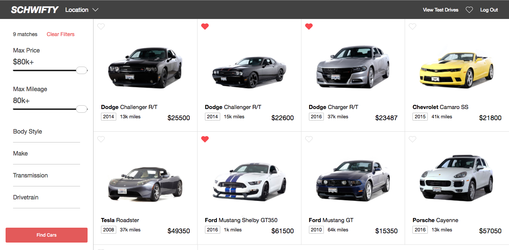
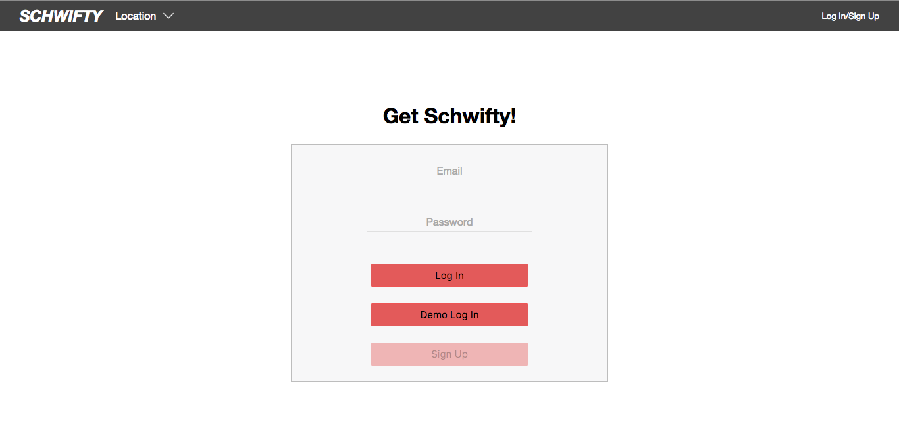

# Schwift(y)

[Schwift(y) live][heroku]

[heroku]: https://schwifty.herokuapp.com/

Schwift(y) is a full-stack web application inspired by Shift.  It utilizes Ruby on Rails on the backend, a PostgreSQL database, and React.js with a Redux architectural framework on the frontend. This project was a two-week hack to see how fast I could build across the stack.

## Features & Implementation

 The original site has two main views: cars/:region and car/:id.

 I started with a limited subset of the site's features as my "goal" for replication. I then modified that to include features such as user authentication and user-bound database operations for booking test drives (as opposed to the actual site's implementation).

### [cars/:region]
[cars/:region]: https://schwifty.herokuapp.com/#/cars

 The basic "region" is one that is location agnostic and allows you to search vehicles across all regions. These views support filtering of the available cars and is implemented through a dynamic SQL query (code snippet below).
 
 
 
 The other regions apply a basic filter that searches cars only in that region via a simply database query.
 
 The following is a dynamically formed query that I used to respond to the search filters sent by the front-end
 
 ```Ruby
  def getCarsWithParams(tags, location)
    whereInStr = composeWhereStr(tags) || ""
    #TODO: include location
    whereInStr.concat(" AND ") unless whereInStr.empty?
    queryStr = whereInStr + "cars.mileage <= #{tags[:maxMiles]}" + " AND cars.price <= #{tags[:maxPrice]}"
    queryStr.concat(" AND UPPER(cars.location) LIKE '#{location.upcase}'") unless location.empty?
    Car.find_by_sql(["
      SELECT 
        *
      FROM cars
      WHERE 
        #{queryStr}
     "])
  end
```

### [car/:id]
[car/:id]: https://schwifty.herokuapp.com/#/car/1

This car detail was a quick build in order to complete the features I desired in this project. It displays basic info about the cars and allows you to book a test drive for that car.


### [/login]
[/login]: https://schwifty.herokuapp.com/#/login

The sign in page was kept simple and clean. A demo login is provided for minimal hassle if someone wants to play with the site. Errors render above the login form in small, red error text. 

 

## Future Directions for the Project

Though I will likely not revisit this project, it has been a good framework for polishing skills (particularly my CSS skills). Below are some features that I would have liked to implement if I had worked faster.

### Car Detail
It would have been nice to replicate the exact layout from the actual site. However, things like the secondary navbar attaching on scroll would have taken large amounts of time that I didn't have.

### Car Sale

The original site has a really interesting table flow for submitting a car for sale. I would have liked to implement this, but the "how" of is currently not obvious to me and would require research.
